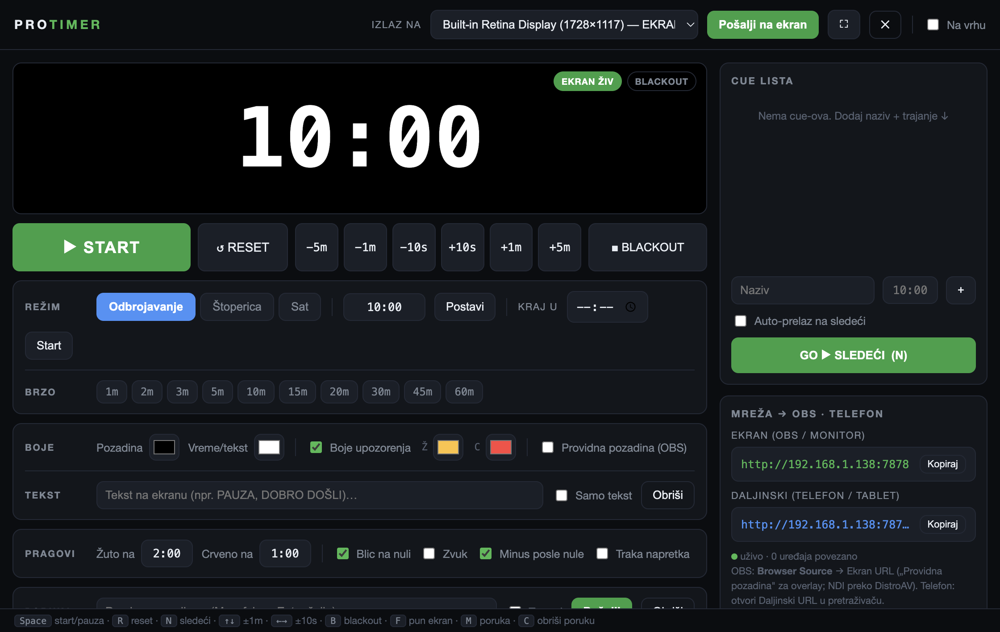

# ⏱️ ProTimer

**Besplatan, profesionalni stage timer za live produkciju.** Veliko, jasno odbrojavanje na bilo kom ekranu — bina, projektor, OBS, ili telefon u ruci. Otvoren kod, radi na **Mac-u i Windows-u**.

> *English: a free, open-source stage / countdown timer for live events and streaming. Send the clock to any screen, into OBS as a browser source, or control it from your phone. (Interface is in Serbian.)*



---

## ✨ Šta dobijaš

- 🟢 **Odbrojavanje, štoperica i sat** — plus „start do tačnog vremena" (npr. kraj bloka u 14:30)
- 🎨 **Gol, čist ekran** — samo vreme; boje pozadine i cifara biraš sam
- 🔴 **Upozorenja bojom** — belo → žuto → crveno kako se bliži kraj; posle nule ide u minus + blic
- 🖥️ **Bilo koji ekran** — pošalji izlaz na drugi monitor / projektor u pun ekran jednim klikom
- 📺 **OBS / NDI / vMix** — ugrađen mrežni izlaz; dodaš kao Browser Source (i providna pozadina za overlay)
- 📱 **Daljinski sa telefona** — pokreći tajmer i šalji poruke govorniku iz ruke, preko Wi-Fi-ja
- 💬 **Poruke govorniku** + ✍️ **tekst na ekranu** („PAUZA", „DOBRO DOŠLI")
- 🗒️ **Cue lista** — niz tačaka sa trajanjima, dugme GO za sledeću
- ⌨️ **Prečice** za sve, ⚡ niska latencija (bez kašnjenja i drifta)

---

## ⬇️ Preuzimanje i instalacija

Skini poslednju verziju sa **[Releases stranice](../../releases/latest)**:

| Sistem | Fajl | Kako |
|---|---|---|
| 🍎 **macOS** (Apple Silicon) | `ProTimer-*-arm64.dmg` | Otvori → prevuci u Applications. Prvi put: **desni klik → Open**. |
| 🪟 **Windows** | `ProTimer Setup *.exe` | Pokreni instaler. SmartScreen: **More info → Run anyway**. |
| 🪟 **Windows** (bez instalacije) | `ProTimer-*-portable.exe` | Samo dupli klik — ništa se ne instalira. |

> Aplikacija nije plaćeno potpisana (košta), zato gornje „desni klik → Open" / „Run anyway". Potpuno je bezbedna — kod je ovde, otvoren.

---

## 🚀 Brzi početak (30 sekundi)

1. Otvori ProTimer — odmah dobiješ **dva prozora**: *Kontrola* (za tebe) i *Ekran* (čisto vreme).
2. Upiši trajanje (npr. `5:00`) ili klikni dugme `5m`, pa **START** (ili `Space`).
3. Prevuci *Ekran* prozor na projektor — ili gore izaberi monitor i klikni **„Pošalji na ekran"** za pun ekran.
4. Gotovo. Sa `±` dugmadima dodaješ/oduzimaš vreme uživo dok tajmer radi.

---

## 📖 Kako se koristi

### Modovi tajmera
- **Odbrojavanje** — glavni mod. Uneseš trajanje (`10` = minuti, `10:30` = MM:SS, `1:00:00` = HH:MM:SS).
- **Štoperica** — broji na gore od nule.
- **Sat** — prikazuje tačno vreme.
- **„Kraj u"** — uneseš sat (npr. 20:30) i tajmer odbrojava do tog trenutka.

### Slanje na bilo koji ekran
Gore u vrhu izaberi monitor i klikni **„Pošalji na ekran"** — na drugom monitoru ide automatski u pun ekran. Priključiš projektor usred programa? Izlaz sam skoči na njega. Na izlaznom prozoru dvoklik = pun ekran, `Esc` = nazad.

### 📺 OBS / NDI / streaming
U panelu **„Mreža → OBS · Telefon"** stoji URL (npr. `http://192.168.1.50:7878`).
1. U OBS dodaj **Browser Source** i nalepi taj URL.
2. Uključi **„Providna pozadina"** u ProTimer-u → tajmer je čist overlay preko slike.
3. Za **NDI**: pusti taj browser source kroz OBS i uključi OBS NDI izlaz (DistroAV plugin).

Isti URL možeš otvoriti na bilo kom računaru/TV-u na mreži kao pomoćni monitor.

### 📱 Daljinski sa telefona
U istom panelu je i **Daljinski** URL (`…:7878/remote`). Otvori ga u pretraživaču telefona (mora biti na istom Wi-Fi-ju). Dobiješ velike dugmiće: Start/Pauza, Reset, ±vreme, GO sledeći, blackout, brzo trajanje i poruke govorniku. *(Glavni ProTimer mora ostati otvoren na računaru.)*

### 🎨 Boje i tekst
- **Boje**: biraš pozadinu i boju cifara. „Boje upozorenja" pale žuto/crveno pred kraj (možeš ih isključiti).
- **Tekst na ekranu**: upišeš poruku (npr. `PAUZA`) — stoji iznad vremena, ili uključi **„Samo tekst"** da prekrije vreme.
- **Poruka govorniku**: kratka poruka na dnu ekrana, sa opcijom da treperi.

### 🗒️ Cue lista
Dodaj tačke programa (naziv + trajanje) desno. Klik na tačku je učita, **GO** (`N`) pušta sledeću. Može i auto-prelaz.

### ⌨️ Prečice
| Taster | Radnja | | Taster | Radnja |
|---|---|---|---|---|
| `Space` | Start / pauza | | `B` | Blackout |
| `R` | Reset | | `F` | Pun ekran |
| `N` | Sledeći cue | | `M` | Poruka (Enter šalje) |
| `↑` / `↓` | ± 1 minut | | `C` | Obriši poruku |
| `←` / `→` | ± 10 sekundi | | `Esc` | Izlaz iz punog ekrana |

---

## 🛠️ Za programere (pokretanje iz koda)

Treba ti [Node.js](https://nodejs.org).

```bash
git clone https://github.com/srdjankotarlic/protimer.git
cd protimer
npm install
npm start            # pokreni aplikaciju

npm run smoke        # automatski test (prozori + mreža + daljinski)
npm run dist:mac     # napravi Mac .dmg
npm run dist:win     # napravi Windows instaler + portable
```

Čist stack, bez runtime zavisnosti: **Electron** + običan HTML/CSS/JS + Node `http` server (SSE). Cela logika je u `controller.html` (kontrola), `output.html` (ekran/OBS), `remote.html` (telefon) i `main.js` (prozori + server).

---

## 📄 Licenca

[MIT](LICENSE) — slobodno koristi, menjaj i deli. Ako ti pomogne u produkciji, ⭐ na repo-u znači mnogo.

Napravio [Srdjan Kotarlic](https://github.com/srdjankotarlic) za live produkciju.
