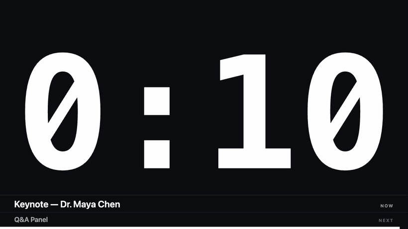
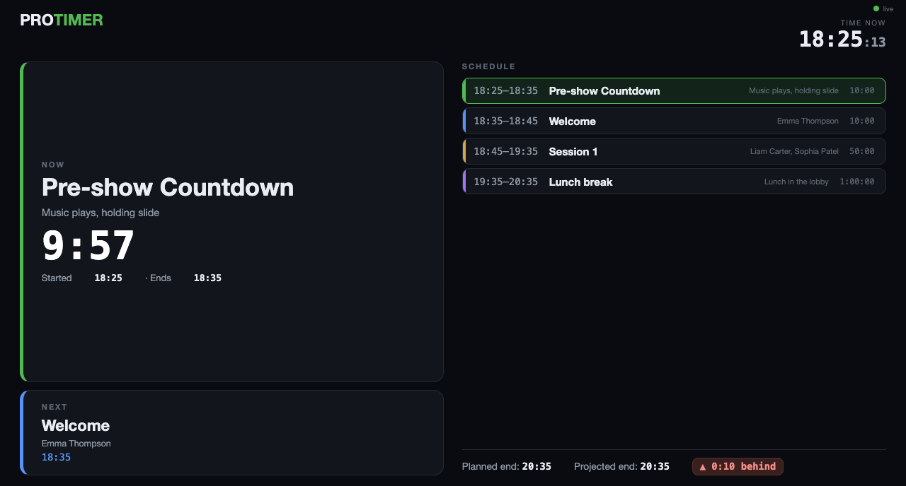

# ⏱️ ProTimer

**A free, open-source stage timer for live production.** Big, clear countdown on any screen — stage, projector, OBS, or a phone in your hand. Runs on **macOS and Windows**, with a **Serbian / English** interface.

[](https://github.com/srdjankotarlic/protimer/releases/latest)
&nbsp;
[](https://github.com/srdjankotarlic/protimer/releases/latest)
&nbsp;
[](LICENSE)

> ### 👉 [Download for macOS or Windows](https://github.com/srdjankotarlic/protimer/releases/latest) — free, no sign-up



---

## ✨ Features

- 🟢 **Countdown, stopwatch & clock** — plus "count down to an exact time" (e.g. end the block at 2:30 PM)
- 🎨 **Clean output screen** — just the time; you pick the background and digit colors
- 🔴 **Color warnings** — white → yellow → red as the end approaches; counts past zero into the negative with a flash
- 🖥️ **Any screen** — send the output to a second monitor / projector in fullscreen with one click
- 🔲 **Grid placement** — pick a cell of a 3×3 / 5×5 / 7×7 / 9×9 grid and the **output window becomes that exact cell of the screen** — a small, frameless timer window sitting precisely where you want it (pair with *Transparent* for a clean see-through corner overlay)
- 📐 **Compact window** — when not fullscreen, the output window can hug the timer: a small timer means a small window, no big black box
- 📺 **OBS / NDI / vMix** — built-in network output; add it as a Browser Source (transparent background for overlays)
- 📱 **Phone remote** — start the timer and send messages to the speaker from your hand, over Wi-Fi
- 🎛️ **Stream Deck / HTTP API** — control the timer from Bitfocus Companion (its built-in *Generic HTTP* module), a Stream Deck, or plain `curl` — no extra plugin needed
- 🔗 **Share with anyone** — a **QR code** to scan on-site, or a one-click **public link** that works from any network
- 🗒️ **Rundown** — a run of segments with **durations, notes, colors and planned clock times**
- 🎭 **Backstage view** — a crew/guest screen with **NOW / NEXT**, the full schedule and live clock times
- ⏰ **Over / Under** — see at a glance whether the show will finish **ahead or behind** schedule
- 📍 **NOW / NEXT** on the stage screen — presenters always see what's current and what's next
- 💬 **Messages to the speaker** + ✍️ **on-screen text** ("BREAK", "WELCOME")
- 🌍 **Serbian / English** interface, ⌨️ keyboard shortcuts, ⚡ low latency (no lag, no drift)

The **control window** — your cockpit: transport, modes, colors, rundown and the network/OBS links:


The **Backstage** view — `NOW`, `NEXT`, the schedule and an over/under indicator, on any screen or phone:



---

## ⚖️ How does it compare?

ProTimer doesn't try to beat the big tools at everything — it aims to be the simplest **free** one that just works for the core job.

| | **ProTimer** | StageTimer | Ontime | CueTimer |
|---|:---:|:---:|:---:|:---:|
| Price | **Free** | Free → $210–980 | **Free** (cloud paid) | $50+/yr |
| Open-source | ✅ | ❌ | ✅ | ❌ |
| Runs locally, no account | ✅ | desktop tier | ✅ | ✅ |
| Transparent OBS overlay | ✅ | ✅ | ✅ | ✅ |
| Phone remote · QR · public link | ✅ | ✅ | partial | ✅ |
| Rundown + backstage view | ✅ basic | ✅ | ✅ advanced | ✅ |
| HTTP API (Stream Deck / Companion) | ✅ | ✅ | ✅ | ✅ |
| OSC / native Companion module | ❌ | ✅ | ✅ | ✅ |
| Serbian interface | ✅ | ❌ | ❌ | ❌ |

**Honest take:** if you need deep integrations (OSC, Companion, vMix/Qlab) or multi-operator collaboration, [Ontime](https://www.getontime.no/) and [StageTimer](https://stagetimer.io/) are more mature — they're great tools. ProTimer wins when you want something **free, simple, no-account and bilingual** that you open and use in seconds.

---

## ⬇️ Download & install

Grab the latest build from the **[Releases page](../../releases/latest)**:

| System | File | How |
|---|---|---|
| 🍎 **macOS** (Apple Silicon) | `ProTimer-*-arm64.dmg` | Open → drag to Applications. First launch: **right-click → Open**. |
| 🪟 **Windows** | `ProTimer Setup *.exe` | Run the installer. SmartScreen: **More info → Run anyway**. |
| 🪟 **Windows** (no install) | `ProTimer-*-portable.exe` | Just double-click — nothing gets installed. |

> The app isn't paid-signed (that costs money), hence the "right-click → Open" / "Run anyway" the first time. It's completely safe — the source is right here, open.

---

## 🚀 Quick start (30 seconds)

1. Open ProTimer — you immediately get **two windows**: *Control* (for you) and *Screen* (clean time).
2. Type a duration (e.g. `5:00`) or click the `5m` button, then **START** (or `Space`).
3. Drag the *Screen* window onto your projector — or pick a monitor at the top and click **"Send to screen"** for fullscreen.
4. Done. Use the `±` buttons to add/remove time live while the timer runs.

---

## 📖 How to use

### Timer modes
- **Countdown** — the main mode. Enter a duration (`10` = minutes, `10:30` = MM:SS, `1:00:00` = HH:MM:SS).
- **Stopwatch** — counts up from zero.
- **Clock** — shows the current time of day.
- **"End at"** — enter a time (e.g. 20:30) and it counts down to that moment.

### Send to any screen
At the top, pick a monitor and click **"Send to screen"** — on a second monitor it goes fullscreen automatically. Plug in a projector mid-show? The output jumps to it. On the output window, double-click = fullscreen, `Esc` = back.

### 📺 OBS / NDI / streaming
The **"Network → OBS · Phone"** panel shows a URL (e.g. `http://192.168.1.50:7878`).
1. In OBS, add a **Browser Source** and paste that URL.
2. Enable **"Transparent background"** in ProTimer → the timer becomes a clean overlay over your video.
3. For **NDI**: run that browser source through OBS and enable OBS NDI output (DistroAV plugin).

Open the same URL on any computer/TV on the network as a confidence monitor.

### 📱 Phone remote
The same panel has a **Remote** URL (`…:7878/remote`). Open it in your phone's browser (same Wi-Fi). You get big buttons: Start/Pause, Reset, ±time, GO next, blackout, quick durations, and messages to the speaker. *(The main ProTimer must stay open on the computer.)*

### 🎛️ Stream Deck / Companion / HTTP API
Every command is a simple **HTTP GET** — the network panel shows a ready-made **API** URL (with your session token) to copy:

```
http://<ip>:7878/cmd?type=start&t=<token>
```

Available `type` values: `start` (toggles start/pause), `reset`, `go` (next cue), `blackout`, `adjust&value=<seconds>` (e.g. `-60`), `setDuration&value=<ms>`, `mode&value=countdown|countup|clock`, `message&value=<text>`, `clearMessage`, `text&value=<text>`, `clearText`.

**Stream Deck via [Bitfocus Companion](https://bitfocus.io/companion):** add a **Generic HTTP** connection, create a button with an *HTTP GET* action, and paste the API URL (change `type` per button). That's it — Start, Reset, GO and ±1min on physical keys, no plugin required. Works from `curl`, Keyboard Maestro, or any automation too. The token changes on every app launch (security), so re-copy the URL after restarting ProTimer.

### 🎨 Colors & text
- **Colors**: pick the background and digit color. "Warning colors" turn yellow/red near the end (you can turn them off).
- **Transparent background**: makes the screen see-through — for OBS overlays, and the desktop output window itself becomes a frameless floating overlay you can drag onto anything.
- **On-screen text**: type a message (e.g. `BREAK`) — it sits above the time, or enable **"Text only"** to replace the time entirely.
- **Message to speaker**: a short line at the bottom of the screen, with an optional flash.

### 🗒️ Rundown
Build your run on the right: each item has a **name, duration, an optional note and a color**. Set a **Start** time for the show and ProTimer fills in the **planned clock times** for every item. Click an item to load it; **GO** (`N`) jumps to and starts the next one. Optional auto-advance. The **Over / Under** badge shows whether you'll finish ahead or behind your planned end.

Turn on **"NOW / NEXT on screen"** to show the current and next item under the timer on the stage screen.

### 🔗 Share with others
Next to every link in the network panel there's a **QR** button — show it and people scan it with their phone to watch the timer (same Wi-Fi). Need someone **off your network** (a remote client, another venue)? Click **Share online** and ProTimer gives you a public `https://` link that works from anywhere. *(First-time visitors to a public link may see a one-time “Click to continue” page.)*

### 🎭 Backstage view (crew & guests)
The network panel has a **Backstage** URL. Open it on any screen, laptop or phone and everyone sees the same picture: the **current item** with its live timer, **what's next**, the **full schedule** with clock times, and the **planned vs projected finish** with the over/under indicator. Ideal for a green room, a stage manager, or a lobby screen.

### 🌍 Language
Switch between **SR / EN** with the toggle next to the logo, top-left. The choice is remembered and also applies to the phone remote.

### ⌨️ Shortcuts
| Key | Action | | Key | Action |
|---|---|---|---|---|
| `Space` | Start / pause | | `B` | Blackout |
| `R` | Reset | | `F` | Fullscreen |
| `N` | Next cue | | `M` | Message (Enter sends) |
| `↑` / `↓` | ± 1 minute | | `C` | Clear message |
| `←` / `→` | ± 10 seconds | | `Esc` | Exit fullscreen |

---

## 🛠️ For developers (run from source)

You need [Node.js](https://nodejs.org).

```bash
git clone https://github.com/srdjankotarlic/protimer.git
cd protimer
npm install
npm start            # run the app

npm run smoke        # automated test (windows + network + remote)
npm run dist:mac     # build the macOS .dmg
npm run dist:win     # build the Windows installer + portable
```

Clean stack, almost no dependencies: **Electron** + plain HTML/CSS/JS + a Node `http` server (SSE), with `qrcode` and `localtunnel` for the share features. All the logic lives in `controller.html` (control), `output.html` (screen/OBS), `backstage.html` (crew schedule), `remote.html` (phone), and `main.js` (windows + server).

---

## 🗺️ Roadmap

Ideas on the list (feedback very welcome — open an issue to vote or suggest):

- [ ] Signed / notarized builds (no “unidentified developer” warning)
- [ ] Import a rundown from Excel / Google Sheets / CSV
- [ ] Groups/blocks in the rundown (e.g. *Morning Sessions*, *Lunch*)
- [x] ~~HTTP control API~~ — done (works with Companion's Generic HTTP module + Stream Deck)
- [ ] Native OSC + dedicated Bitfocus Companion module
- [ ] More languages
- [ ] Multiple independent timers

## ⚠️ Known limitations

Being honest about where it's at:

- **Unsigned builds.** macOS shows “unidentified developer” (right-click → Open) and Windows shows SmartScreen (More info → Run anyway) on first launch. Code signing is on the roadmap.
- **Network sharing needs the same Wi-Fi** — unless you use the optional **Share online** link, which is **beta** (a tunnel; may show a one-time “continue” page, and reliability depends on the tunnel service). For shows, the LAN + QR path is the dependable one.
- **Remote control is link-based.** Anyone with the exact `…/remote?t=…` link can control the timer — share it deliberately.
- **Single operator** — no real-time multi-user collaboration (see Ontime/StageTimer if you need that).
- **Builds:** macOS (Apple Silicon) and Windows (x64). No Intel-mac or Linux builds yet.

## 🤝 Contributing

Issues and pull requests are welcome — bug reports, feature ideas, translations, docs.

1. Open an [issue](../../issues) (there are templates for bugs and features).
2. For code: fork, `npm install`, make your change, run `npm run smoke`, open a PR.
3. Keep it simple — the whole point of ProTimer is that it stays small and obvious.

If you use ProTimer on a show, a ⭐ or a quick note about what worked (or didn't) genuinely helps.

---

## 👤 Author

**ProTimer** is created and maintained by **Srdjan Kotarlic** — built from real live-production needs.

- GitHub: [@srdjankotarlic](https://github.com/srdjankotarlic)
- LinkedIn: [Srdjan Kotarlic](https://www.linkedin.com/in/srdjan-kotarlic-82904012b/)

If it helps your show, a ⭐ on the repo means a lot. Issues and ideas are welcome.

## 📄 License

© 2026 Srdjan Kotarlic. Released under the [MIT License](LICENSE) — free to use, modify and share, with attribution.
