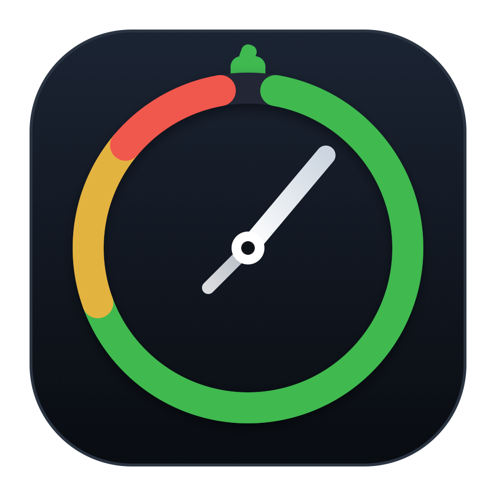
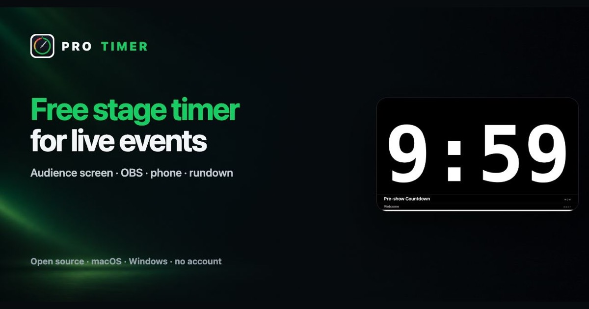

<p align="center">
  
</p>

<h1 align="center">ProTimer</h1>

<p align="center">
  <strong>A free stage timer and speaker countdown for live events, conferences, presentations and OBS.</strong><br>
  Send a clear timer to a projector, confidence monitor, browser source or phone from one local app.
</p>

<p align="center"><strong>Latest release: ProTimer 2.1.0 — free, open source, no account and no watermark.</strong></p>

<p align="center">
  <a href="https://github.com/srdjankotarlic/protimer/actions/workflows/ci.yml"></a>
  <a href="https://github.com/srdjankotarlic/protimer/releases/latest"></a>
  <a href="LICENSE"></a>
  
  
</p>

<p align="center">
  <a href="README.sr.md"><strong>Srpski</strong></a>
  ·
  <a href="https://srdjankotarlic.github.io/protimer/"><strong>Product page</strong></a>
  ·
  <a href="#download-and-install"><strong>Download</strong></a>
  ·
  <a href="#quick-start-60-seconds"><strong>Quick start</strong></a>
  ·
  <a href="SUPPORT.md"><strong>Support</strong></a>
  ·
  <a href="CHANGELOG.md"><strong>Changelog</strong></a>
</p>



## Download and install

> **Download one recommended installer for your computer.** GitHub's automatic `Source code` ZIP and TAR.GZ files are for developers and will not install ProTimer.

| Your computer | Recommended download | Install |
|---|---|---|
| Apple Silicon Mac (M1 or newer) | **[Download the macOS DMG](https://github.com/srdjankotarlic/protimer/releases/download/v2.1.0/ProTimer-2.1.0-arm64.dmg)** | Open the DMG and drag **ProTimer** to Applications. |
| Windows 10/11 x64 | **[Download the Windows installer](https://github.com/srdjankotarlic/protimer/releases/download/v2.1.0/ProTimer-Setup-2.1.0.exe)** | Run Setup and follow the installer. |

Need a Windows build that does not install? Use the [portable EXE](https://github.com/srdjankotarlic/protimer/releases/download/v2.1.0/ProTimer-2.1.0-portable.exe). Most Windows users should choose Setup.

Every installer is built by the public release workflow. You can verify a download with the [ProTimer 2.1.0 SHA-256 checksums](https://github.com/srdjankotarlic/protimer/releases/download/v2.1.0/ProTimer-2.1.0-SHA256SUMS.txt).

<details>
<summary><strong>First-launch security warning</strong></summary>

The current downloads are not Apple-notarized or Windows Authenticode-signed.

- On macOS, confirm the DMG came from this repository. If Gatekeeper blocks the app, use **System Settings -> Privacy & Security -> Open Anyway**.
- On Windows, SmartScreen may show **Unknown publisher**. Continue only for the installer downloaded from this repository.

</details>

## New in ProTimer 2.1

- **Clear operator preview:** the timer in Control stays large and centred while grid placement moves only the real audience output.
- **Faster duration entry:** the main timer and every rundown cue share one clear `HH:MM:SS` picker, step controls and minute presets.
- **A rundown built for real shows:** **START RUNDOWN** launches cue one, and long rundowns scroll while every cue keeps a readable height.
- **Cleaner audience output:** the desktop timer is frameless, movable and resizable by mouse; fullscreen remains safely controlled from Control.
- **QR access for the audience:** show a view-only Timer or Backstage QR directly on the output. Remote-control URLs are never offered to the audience.
- **Stable phone viewing:** phone clocks synchronise to the ProTimer host and rendering is rate-limited to avoid drift and unnecessary lag.

See the complete [2.1.0 release notes](docs/RELEASE-NOTES-2.1.0.md).

## Quick start (60 seconds)

1. Install and open ProTimer — it creates **Control** for the operator and a clean **Screen** window for the audience.
2. Open **Duration**, set hours/minutes/seconds (or choose a quick preset), then press **START** or `Space`.
3. Drag and resize the frameless Screen window, or select a monitor and use **Send to screen** / fullscreen from Control.
4. To let people follow on phones, open the network panel, select the view-only Timer or Backstage **QR**, then choose **Show QR to audience**.


## What ProTimer does

- **Countdown, stopwatch and clock** with warning colors, overtime and an exact end-time mode.
- **Dedicated stage output** for a projector, second display or confidence monitor.
- **Transparent OBS browser-source timer** for livestream and recording overlays.
- **Phone remote and QR access** over the local production network, including an audience QR on the stage output.
- **Simple event rundown** with NOW, NEXT, planned times and over/under status.
- **Backstage view** for crew, green room, stage manager or lobby display.
- **Stream Deck and automation control** through Bitfocus Companion, HTTP and OSC.
- **Excel/Sheets rundown paste**, speaker messages, grid placement and a compact output option.
- **English and Serbian interface**, no account, no subscription and no watermark.

ProTimer is designed for small and medium live events that need reliable speaker timing without a complex show-control system.

The **control window** keeps timer transport, display output, rundown and network links in one place:


The **Backstage view** shows NOW, NEXT, the schedule and over/under status on any browser:


<details>
<summary><strong>📖 Open the full operator guide</strong> — display, OBS, phones, rundown, automation and shortcuts</summary>

<a id="how-to-use"></a>

## How to use

### Timer modes
- **Countdown** — the main mode. Open **Duration** and set `HH:MM:SS`, use the `+`/`−` controls, or choose a minute preset.
- **Stopwatch** — counts up from zero.
- **Clock** — shows the current time of day.
- **"End at"** — enter a time (e.g. 20:30) and it counts down to that moment.

### Send to any screen
The desktop output is always a clean frameless window: drag anywhere on it to move it and drag its edges or corners to resize it. At the top of **Control**, pick a monitor and click **Send to screen**, or use the fullscreen button / `F`. Fullscreen is deliberately controlled only from **Control**, so accidental clicks on the audience screen cannot change it.

### 📺 OBS / NDI / streaming
The **"Network → OBS · Phone"** panel shows a URL (e.g. `http://192.168.1.50:7878`).
1. In OBS, add a **Browser Source** and paste that URL.
2. Enable **"Transparent background"** in ProTimer → the timer becomes a clean overlay over your video.
3. For **NDI**: run that browser source through OBS and enable OBS NDI output (DistroAV plugin).

Open the same URL on any computer/TV on the network as a confidence monitor.

### 📱 Phone remote
The same panel has a **Remote** URL (`…:7878/remote`). Open it in your phone's browser (same Wi-Fi). You get big buttons: Start/Pause, Reset, ±time, GO next, blackout, quick durations, and messages to the speaker. *(The main ProTimer must stay open on the computer.)*

### 🎛️ Stream Deck / Companion / HTTP API
Every command is a simple **HTTP GET** — the network panel shows a ready-made **API** URL (with your session token) to copy:

```
http://<ip>:7878/cmd?type=start&t=<token>
```

Available `type` values: `start` (toggles start/pause), `reset`, `go` (next cue), `blackout`, `adjust&value=<seconds>` (e.g. `-60`), `setDuration&value=<ms>`, `mode&value=countdown|countup|clock`, `message&value=<text>`, `clearMessage`, `text&value=<text>`, `clearText`.

**Stream Deck via [Bitfocus Companion](https://bitfocus.io/companion):** two options:
1. **Dedicated module** — [companion-module-protimer](https://github.com/srdjankotarlic/companion-module-protimer): nice actions, live feedbacks (running = green, blackout = red) and a `$(protimer:time)` variable for the button face. Install via Companion's developer-modules path (registry submission pending).
2. **Zero-install** — add a **Generic HTTP** connection, create a button with an *HTTP GET* action, and paste the API URL (change `type` per button).

Works from `curl`, Keyboard Maestro, or any automation too. The token changes on every app launch (security), so re-copy the URL after restarting ProTimer.

### 🎚️ OSC (QLab / TouchOSC / Companion OSC)
ProTimer listens for OSC on **UDP port 7879**. Addresses mirror the HTTP API:

```
/protimer/start          /protimer/reset         /protimer/go
/protimer/blackout       /protimer/adjust 60     /protimer/setDuration 600000
/protimer/message "WRAP UP"                      /protimer/clearMessage
```

Arguments: int/float/string (first argument = `value`). OSC has no token — it's LAN-trusted like QLab/Ontime, so keep the machine on a network you control.

### 🎨 Colors & text
- **Colors**: pick the background and digit color. "Warning colors" turn yellow/red near the end (you can turn them off).
- **Transparent background**: removes the black fill for a clean OBS or desktop overlay. The desktop output remains frameless, movable and resizable with or without transparency.
- **On-screen text**: type a message (e.g. `BREAK`) — it sits above the time, or enable **"Text only"** to replace the time entirely.
- **Message to speaker**: a short line at the bottom of the screen, with an optional flash.

### 🗒️ Rundown
Build your run on the right: each item has a **name, duration, an optional note and a color**. The duration uses the same clear `HH:MM:SS` picker as the main timer. Set a planned show start and ProTimer fills in the clock times for every item. **START RUNDOWN** always starts the first item; **GO** (`N`) jumps to and starts the next one. Long rundowns keep every row at full readable height inside their own scrollable list. Optional auto-advance. The **Over / Under** badge shows whether you'll finish ahead or behind your planned end.

Turn on **"NOW / NEXT on screen"** to show the current and next item under the timer on the stage screen.

### 🔗 Share with others
Next to every link in the network panel there's a **QR** button. For the view-only Timer and Backstage links, choose **Show QR to audience** to place a large scannable code on the stage output; **Hide QR from screen** restores the timer. The control-only Remote URL can never be sent to the audience output. Need someone **off your network** (a remote client, another venue)? Click **Share online** and ProTimer creates a public, view-only `https://` link through a [Cloudflare Quick Tunnel](https://developers.cloudflare.com/cloudflare-one/networks/connectors/cloudflare-tunnel/do-more-with-tunnels/trycloudflare/). The public link is beta and has no uptime guarantee; for a live show, LAN + QR remains the dependable path.

The public viewer receives the timer and rundown state, including cue names and notes, and can open the `/backstage` path. Do not include sensitive notes when sharing online. The command token is not included in the public viewer link. Click **Stop sharing** when the remote viewer is finished.

### 🎭 Backstage view (crew & guests)
The network panel has a **Backstage** URL. Open it on any screen, laptop or phone and everyone sees the same picture: the **current item** with its live timer, **what's next**, the **full schedule** with clock times, and the **planned vs projected finish** with the over/under indicator. Ideal for a green room, a stage manager, or a lobby screen.

### 🌍 Language
Switch between **SR / EN** with the toggle next to the logo, top-left. The choice is remembered and also applies to the phone remote.

### ⌨️ Shortcuts
| Key | Action |
|---|---|
| `Space` | Start / pause |
| `R` | Reset |
| `N` | Next cue |
| `↑` / `↓` | ± 1 minute |
| `←` / `→` | ± 10 seconds |
| `B` | Blackout |
| `F` | Toggle fullscreen from Control |
| `M` | Message (Enter sends) |
| `C` | Clear message |

</details>

---

## 🛠️ For developers (run from source)

You need [Node.js](https://nodejs.org) 24 LTS or newer.

```bash
git clone https://github.com/srdjankotarlic/protimer.git
cd protimer
npm install
npm start            # run the app

npm run smoke        # automated test (windows + network + remote)
npm run dist:mac     # build the macOS .dmg
npm run dist:win     # build the Windows installer + portable
```

Clean stack, almost no dependencies: **Electron** + plain HTML/CSS/JS + a Node `http` server. LAN viewers use SSE; public HTTPS viewers use reliable versioned long-polling because Cloudflare Quick Tunnels do not support SSE. Browser clocks synchronise to the ProTimer host, preventing phone-clock drift. `qrcode`, a bundled and verified official `cloudflared` binary and a `localtunnel` fallback provide the share features. All the logic lives in `controller.html` (control), `output.html` (screen/OBS), `backstage.html` (crew schedule), `remote.html` (phone), and `main.js` (windows + server).

---

## 🗺️ Roadmap

Ideas on the list (feedback very welcome — open an issue to vote or suggest):

- [ ] Signed / notarized builds (no “unidentified developer” warning)
- [x] ~~Paste a rundown from Excel / Google Sheets~~ — done (tab-separated rows paste directly into the rundown card)
- [ ] Groups/blocks in the rundown (e.g. *Morning Sessions*, *Lunch*)
- [x] ~~HTTP control API~~ — done (works with Companion's Generic HTTP module + Stream Deck)
- [x] ~~Native OSC + dedicated Bitfocus Companion module~~ — done ([module repo](https://github.com/srdjankotarlic/companion-module-protimer); official registry submission pending)
- [ ] More languages
- [ ] Multiple independent timers

## ⚠️ Known limitations

Being honest about where it's at:

- **Unsigned builds.** macOS shows “unidentified developer” (right-click → Open) and Windows shows SmartScreen (More info → Run anyway) on first launch. Code signing is on the roadmap.
- **Network sharing needs the same Wi-Fi** — unless you use the optional **Share online** link, which is **beta**. It uses a Cloudflare Quick Tunnel (or a labelled fallback), passes viewer traffic through that provider and has no uptime guarantee. The public viewer can see timer/rundown data, including cue names and notes. For shows, LAN + QR is the dependable and private path.
- **Remote control is link-based.** Anyone with the exact `…/remote?t=…` link can control the timer — share it deliberately.
- **OSC has no authentication** (UDP, LAN-trusted — same model as QLab/Ontime). Anyone on your network can send OSC commands; use it on networks you control.
- **Single operator** — no real-time multi-user collaboration (see Ontime/StageTimer if you need that).
- **Builds:** macOS (Apple Silicon) and Windows (x64). No Intel-mac or Linux builds yet.

## 🤝 Contributing

Issues and pull requests are welcome — bug reports, feature ideas, translations, docs.

1. Open an [issue](https://github.com/srdjankotarlic/protimer/issues/new/choose) (there are templates for bugs and features).
2. For code: fork, `npm install`, make your change, run `npm run smoke`, open a PR.
3. Keep it simple — the whole point of ProTimer is that it stays small and obvious.

If you use ProTimer on a show, a ⭐ or a quick note about what worked (or didn't) genuinely helps.

---

## 👤 Author

**ProTimer** is created and maintained by **Srdjan Kotarlic** — built from real live-production needs.

- GitHub: [@srdjankotarlic](https://github.com/srdjankotarlic)
- LinkedIn: [Srdjan Kotarlic](https://www.linkedin.com/in/srdjan-kotarlic-82904012b/)

If it helps your show, a ⭐ on the repo means a lot. Issues and ideas are welcome.

## 📄 License

© 2026 Srdjan Kotarlic. Released under the [MIT License](LICENSE) — free to use, modify and share, with attribution. Bundled third-party components retain their own licenses; see [Third-party notices](licenses/THIRD_PARTY_NOTICES.md).
