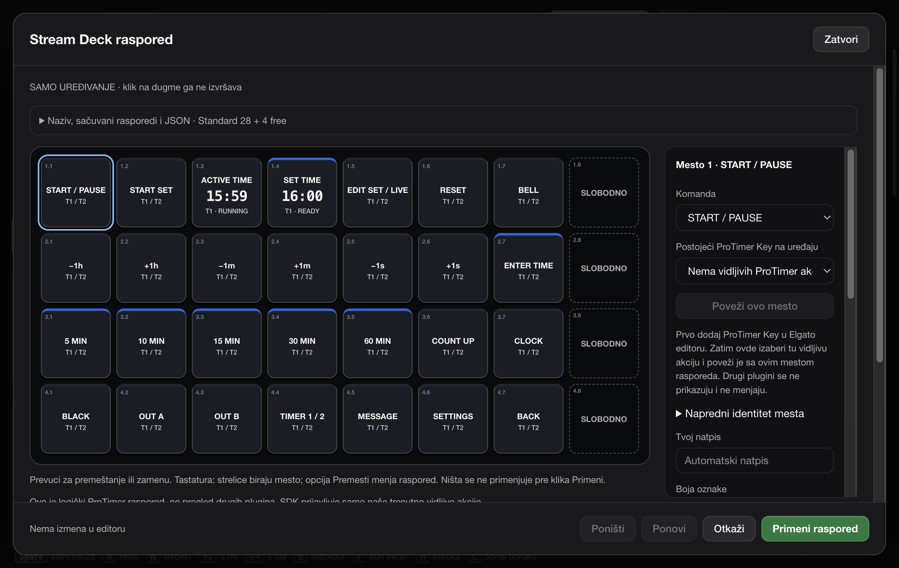

# Stream Deck implementation and verification

**Current prerelease: `2.5.0-streamdeck.3`. Latest stable release: `2.4.1`. Physical Stream Deck acceptance is still pending.**

This page separates local verification from public CI and hardware testing. The command table below records the original `2.5.0-streamdeck.1` preview on 2026-09-25; it is retained as historical evidence. The current prerelease adds independent overtime/blink/bell settings and the 2.2-second synthesized bell; its local results are recorded in [Zero alerts](ZERO-ALERTS.md#local-verification--2026-09-26).

Installers are published only after automated packaged smoke checks pass on macOS and Windows. Check the [public workflow runs](https://github.com/srdjankotarlic/protimer/actions) for those results; the local history below does not establish them. Automated CI does not replace physical Elgato/XL acceptance.

Srpski: Probna verzija uključuje nativni plugin i editor, kao i zasebna upozorenja za oba tajmera. Za završen plug-and-play paket još su potrebni stvarno izvezeni Elgato profili i fizička provera XL-a. Tabela ispod beleži ranije lokalne provere; ne predstavlja potvrdu trenutnog GitHub CI-a ili hardvera.

[Uputstvo na srpskom](STREAM-DECK.sr.md) · [English guide](STREAM-DECK.md) · [SDK constraints and remaining hardware steps](STREAM-DECK-SDK.md)

## Implemented

- The existing Control renderer remains the timer authority. New Control actions, configurable shortcuts and the native plugin use one validated command model and existing engine adapter. Legacy HTTP/OSC/Companion contracts remain in place.
- Independent ACTIVE and SET state for both timers; version-checked atomic START SET; explicit start/pause/resume; reset to the last started duration; separate Clear SET. Numeric HH:MM:SS entry, modes, presets and configurable hour/minute/second corrections do not change ACTIVE until explicitly requested.
- Guarded reset, blackout, LIVE editing and replacement of an active time. Commands pin a concrete timer and versions, expire, deduplicate and cancel on disconnect. No offline command replay.
- Authenticated ephemeral loopback bridge, short-lived passive bootstrap, authoritative-state staleness checks and applied acknowledgements. No second plugin timer engine, HID access or keyboard emulation. Existing LAN authentication is not relaxed.
- Real official-SDK TypeScript plugin, Property Inspector, icons and official-CLI `.streamDeckPlugin` package. Cached LCD images show ACTIVE and SET separately and become stale/offline when host truth disappears.
- Optional Stream Deck Control section and logical 8×4 editor: edit, drag/swap, duplicate, inactive owned slots versus genuinely unassigned logical slots, configuration, validated import/export, named saves, undo/redo and Apply/Cancel. Existing native ProTimer actions can be explicitly bound to logical slots. Foreign actions are not enumerated or overwritten.
- Original synthesized manual bell, local sound choice, volume and audio-output selection where supported; no overlap or silent fallback after an explicitly selected device disappears.
- Real output-window controls, prepared rundown selection, explicit opt-in global shortcuts with native confirmation, and SR/EN help. No automatic profile switching or output opening.

## Not yet delivered / not claimed

There are **no verified native `.streamDeckProfile` exports in this preview**. Standard 28 + 4 free and Full 32 are implemented logical layouts, not invented native profile ZIPs. `Activate ProTimer profile` is disabled; manually place ProTimer Key actions in Elgato, select the profile there, then bind/edit the actions in ProTimer. This is not yet a one-click starter-profile setup.

Native profile import, USB/LCD behavior, multi-device/page behavior, physical BACK, passive focus behavior, audio hardware routing and clean-install onboarding still require Elgato/XL acceptance checks. The original Windows preview was cross-built locally, not executed; current Windows CI results must be checked separately. Physical sleep/wake and an eight-hour live rehearsal have not been performed. See the unchecked hardware checklist in the guides.

## Historical local checks — 2026-09-25, `2.5.0-streamdeck.1`

These commands were run from the repository root for the original preview:

| Command | Observed result |
| --- | --- |
| `npm test` | **103 passed**, 0 failed, 0 skipped/TODO. |
| `npm run deck:test` | TypeScript check passed; **11 plugin tests passed**. Adapter runs the compiled SDK plugin against simulated Elgato WebSocket events and a real local command bridge, not a physical USB device. |
| `npm run deck:package` | Official `streamdeck pack` produced the actual plugin archive. |
| `npm run deck:validate` | Official manifest/package-resource validation passed. |
| `npm run smoke` | Full source Electron smoke passed: existing startup/windows/HTTP/OSC/SSE/polling/phone/rundown/OBS-related contracts plus native integration checks. |
| `npm run smoke:deck` | Integration smoke passed, including **27 editor UI checks** and actual output-window adapter checks. |
| `npm run check:public-docs` | Passed for public version 2.4.1; public download claims were not changed to this preview. |
| `npm run check:packaging` | Passed. |
| `git diff --check` | Passed. |
| `npm run predist:mac` | Plugin dependencies/build/package and bundled tunnel preparation passed. |
| `node scripts/fetch-cloudflared.js win` | Windows tunnel preparation passed. |
| `npx electron-builder --mac --arm64 --dir --publish never -c.extraMetadata.version=2.5.0-streamdeck.1` | macOS ARM64 app produced; bundled plugin and tunnel hashes checked by afterPack. |
| `npx electron-builder --win --x64 --dir --publish never -c.extraMetadata.version=2.5.0-streamdeck.1` | Windows x64 unpacked app produced; resources checked. **Cross-build only, not Windows runtime testing.** |
| `dist-installers/mac-arm64/ProTimer.app/Contents/MacOS/ProTimer --smoke` | Packaged Mac full regression ended with `DECK_SMOKE_OK=true` and `SMOKE_OK`. |

For that original preview, final status wording was corrected to distinguish “no visible ProTimer actions” from an unknowable arbitrary profile identity. Both platform builds were rebuilt after that copy-only correction; the packaged Mac integration smoke was rerun.

The installed Mac preview was opened normally: only **ProTimer — Kontrola** opened, existing settings/rundown were visible, integration remained off by default, and its editor opened without running a timer or output. This is a local app check, not hardware certification.

### Long-run evidence

Model tests advance a simulated clock through 100 hours and verify no 24-hour wrap, stable versions and overtime. Engine-clock tests simulate forward/backward wall-clock changes and 48 hours of suspend elapsed time while preserving paused state and both timers. They validate arithmetic and command invariants, not operating-system event ordering or endurance. Physical sleep/wake, an eight-hour real run, memory stability and USB reconnect latency remain explicit manual tests.

### Regression coverage

The full Mac smoke includes Control-only startup even with restored output settings, explicit window open/close, two independent output placements, grid/scale/resolution, fullscreen, QR, transparency, phone authentication/reconnect, HTTP and OSC compatibility, SSE and long-polling, rundown selection/edit/reset/pause/resume/background auto-advance, and responsive SR/EN controls. The available Built-in Retina and HP display routes were exercised. No Companion application UI or remote physical TV image was claimed as verified.

## Build the current preview locally

```sh
npm ci
npm run deck:build
npm run deck:test
npm run deck:package
npm run deck:validate
npm test
npm run smoke
npm run predist:mac
npx electron-builder --mac --arm64 --dir --publish never -c.extraMetadata.version=2.5.0-streamdeck.3
```

App: `dist-installers/mac-arm64/ProTimer.app`. Plugin: `streamdeck-plugin/dist/com.srdjankotarlic.protimer.streamDeckPlugin`. A separate Windows build produces `dist-installers/win-unpacked/ProTimer.exe`.

The local app includes the real plugin under `Contents/Resources/streamdeck/`; **Control → Stream Deck → Install / update plugin** opens it. End users do not run these development commands or install Node. Elgato's normal installation confirmation still applies. Native profile activation remains unavailable until the verified-export steps are completed.

The local installation check preserved the previous app and user data in a separate backup. Do not restore old user data over newer show changes without reviewing it first. Elgato Marketplace submission and hardware certification are outside the verified scope.

## Changed files

- Engine/Control integration: `controller.html`, `main.js`, `preload.js`, `timer-tools.js`, `engine-clock.js`, `output.html`, `remote.html`.
- Command, bridge, persistence and UI: `deck-model.js`, `deck-layout.js`, `deck-bridge.js`, `deck-host.js`, `deck-controller.js`, `deck-audio.js`, `deck-ui.js`, `deck-ui.css`.
- Native plugin: `streamdeck-plugin/src/{plugin,bridge,logic,shared,types}.ts`, manifest, Property Inspector HTML/CSS/JS, PNG icons, build script, package/lock/tsconfig, protocol and setup documentation.
- Tests: `test/deck-{model,layout,bridge,host,audio}.test.js`, `test/engine-clock.test.js`, extended `test/timer-tools.test.js`, `scripts/smoke-deck.js`, `scripts/smoke-deck-ui.js`, `streamdeck-plugin/test/{adapter,bridge,logic}.test.mjs`.
- Build/CI/docs: `package.json`, `scripts/verify-packaged-tunnel.js`, `.github/workflows/{ci,release}.yml`, `README.md`, `licenses/THIRD_PARTY_NOTICES.md`, `docs/STREAM-DECK*.md`, and the screenshot below. Current remote results are published on the repository's Actions page.

## Actual editor screenshot

Captured from the running Electron app during the isolated integration smoke, not a design mockup or evidence of a connected XL:


