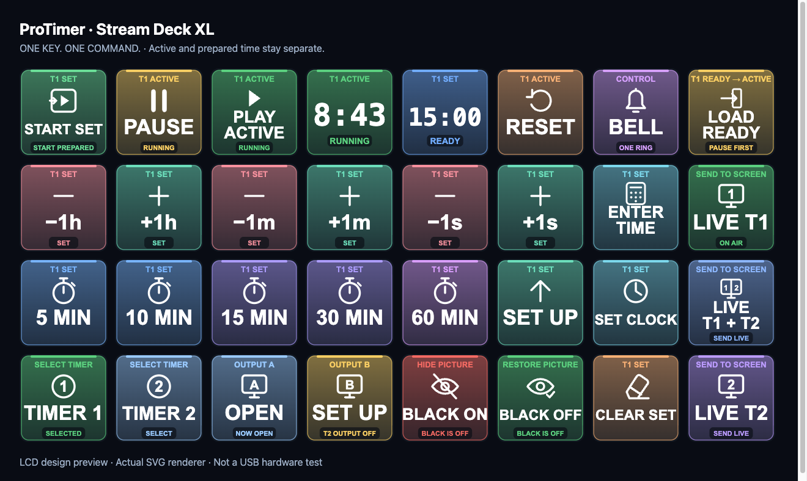

# ProTimer i Stream Deck

[English](STREAM-DECK.md) · [SDK i pakovanje](STREAM-DECK-SDK.md)



**Ukratko:** plugin dolazi uz probnu instalaciju ProTimera. Otvori **Control → Stream Deck → Instaliraj / ažuriraj plugin**, potvrdi u Elgato aplikaciji i klikni **Podesi integraciju**. Paket možeš preuzeti i zasebno iz probnog GitHub izdanja. Ne treba terminal niti Node. Početno postavljanje profila/akcija u Elgato editoru još je potrebno; instalacija plugina nije isto što i aktiviranje profila.

Velike bele ikone i natpisi jasno označavaju funkciju, uz različite grupe boja: zeleno puštanje, žuta pauza, plavo/ljubičasto priprema, mint/roze plus/minus, ljubičasto zvonce, crveno sakrivanje i zeleno vraćanje slike. Ikone ekrana imaju 1, 2 ili podelu 1|2. Status i naziv objašnjavaju dugme i bez oslanjanja samo na boju. Svoje boje i ikone možeš i dalje birati u Elgato editoru.

## READY → ACTIVE i izbor prikaza publici

`LOAD READY` prenosi pripremljeno SET vreme u ACTIVE bez pokretanja. SET ostaje sačuvan. Ako ACTIVE radi, prvo pritisni PAUSE; učitavanje neće prekinuti odbrojavanje. Posle učitavanja koristi PLAY ACTIVE, ili START SET za neposredno učitavanje i puštanje.

`LIVE T1`, `LIVE T1 + T2` i `LIVE T2` jednim dodirom stvarno otvaraju izabrani prikaz na ekranu podešenom u kontroli. Ne pale/gase odbrojavanje. Izaberi Zajedno za podelu na jednom ekranu, ili Odvojeno za dva ekrana. U delu Prozor izlaza i cifre biraš način LIVE slanja: pun ekran ili prozor sa podešenom veličinom/Gridom. Automatski režim koristi pun ekran, osim kada je uključen Grid. Ponovni pritisak ne izlazi iz već aktivnog fullscreen-a. LIVE vraća sliku posle BLACK ON. Za T2 ili oba najpre uključi drugi tajmer. Nepovezan ekran je greška, a ne slanje na neki drugi ekran.

`BLACK ON` sakriva sliku; zasebno dugme `BLACK OFF` vraća sliku jednim pritiskom. Nijedno ne zaustavlja tajmer. Stari BLACK toggle ostaje u katalogu. `PLAY ACTIVE` pokreće već učitano vreme ili ga nastavlja, bez učitavanja SET-a; RESUME ostaje za prilagođene tastere.

Četiri nova dugmeta su u poslednjoj koloni lokalnog Elgato profila. Svako možeš menjati u Elgato softveru: izaberi taster, promeni Action i klikni Save key. Čuvanje podešavanja ne izvršava komandu. Ostalih 28 dugmadi i postojeći Control raspored su zadržani.

ProTimer ostaje program koji meri vreme. Elgato aplikacija upravlja USB uređajem, a native ProTimer plugin šalje stvarne komande postojećem tajmeru. Ne simulira tastaturu i ne pravi svoje odbrojavanje. Companion nije obavezna instalacija; postojeća HTTP/OSC podrška ostaje.

## Šta je dostupno u ovom razvojnom izdanju

Plugin može da se izgradi, validira i spakuje. Editor u Control prozoru uređuje logički raspored 8 × 4 i ProTimer Key akcije koje korisnik postavi kroz Elgato.

**Početni rasporedi još nisu potvrđeni, izvezeni Elgato profili.** Zato je dugme **Aktiviraj ProTimer profil** nedostupno dok se stvarni profili ne izvezu, dodaju u plugin i provere. Za sada ručno napravi/izaberi profil u Elgato aplikaciji, dodaj ProTimer Key akcije i poveži ih kroz Control. To je podržan ručni put, a ne obećanje gotovog automatskog postavljanja profila.

Na lokalnom Macu dostupni su Elgato softver i korisnikov XL profil. Instalacija, povezivanje i LCD grafika mogu da se provere; automatski SDK testovi simuliraju pritiske i nisu dokaz rada fizičkog USB tastera. Pre nastupa uradi proveru stvarnog uređaja na kraju ovog uputstva.

## Prvo povezivanje

Potrebni su Windows 10+ x64 ili macOS 13+ Apple Silicon, u okviru podržanih sistema same ProTimer aplikacije, i **Elgato Stream Deck 7.0+**. Plugin koristi zvanični SDK 3 i Node 20 koji obezbeđuje Elgato. Korisnik ne instalira Node, ne otvara terminal i ne pokreće server.

1. Otvori **ProTimer Control → Stream Deck**. Integracija je opciona; tajmer radi i kada je isključena.
2. Klikni **Instaliraj / ažuriraj plugin**. Otvara se pravi `.streamDeckPlugin` paket. Potvrdi instalaciju koju traži Elgato.
3. Klikni **Podesi integraciju** i uključi povezivanje. Lokalno uparivanje koristi podržani deep-link mehanizam, bez upisivanja IP adrese i stalnog kopiranja tokena.
4. Sačekaj potvrdu od plugina i izaberi uređaj. Sam folder na disku nije dokaz da plugin radi.
5. U ovom izdanju napravi profil u Elgato aplikaciji i prevuci **ProTimer Key** na željena dugmad. Za četiri stvarno slobodna mesta ostavi poslednju kolonu praznu.
6. Otvori **Uredi raspored**, izaberi logičko mesto, pronađi odgovarajući vidljivi **ProTimer Key na uređaju**, pa klikni **Poveži ovo mesto**. Novi raspored prvo primeni. Ovim se povezuje naša već postavljena akcija; ne dodaje se dugme preko tuđe OBS/Elgato akcije.

Povezivanje nije aktiviranje profila. Pokretanje ProTimera, promena fokusa, USB reconnect ili restart plugina ne smeju sami promeniti profil. Kada potvrđeni profili budu dostupni, aktiviranje iz Control prozora biće isključivo tvoj ručni izbor, bez startovanja vremena ili otvaranja izlaza.

## ACTIVE i SET

**ACTIVE** je postojeće aktivno vreme. **SET** je pripremljeno vreme za sledeće pokretanje. Svaki od dva tajmera ima oba podatka; Tajmer 2 nije SET Tajmera 1.

- Dok ACTIVE radi na `08:43`, promeni SET sa `15:00` na `16:00`. ACTIVE nastavlja normalno.
- Šest tastera −/+ za sate, minute i sekunde podrazumevano menja SET. Korak i jedinicu menjaš u editoru.
- **EDIT SET/LIVE** namerno prebacuje korekcije na aktivno vreme. Ulazak u LIVE traži zaštitu; povratak u SET je odmah. Preseti uvek menjaju SET.
- **START SET** jednim dodirom na Decku atomski učitava baš potvrđenu verziju SET-a i pokreće tajmer. Odmah zamenjuje tekuće ili pauzirano vreme. Potvrde u Controlu i na tastaturi ostaju.
- **START/PAUSE** startuje, pauzira ili nastavlja samo već učitani ACTIVE. Nikad ne učitava SET krišom.
- **RESET** jednim dodirom zaustavlja i vraća ACTIVE na poslednje pokrenuto trajanje. SET ostaje. **CLEAR SET** je zasebna komanda.
- Promena ciljnog tajmera, restart ili prekid veze vraća korekcije na SET. Na prikazima i komandama jasno se razlikuju T1 i T2.

### Unos 01:23:45 bez tastature

Pritisni **ENTER TIME**. Izaberi sate i unesi `0`, `1`; minute `2`, `3`; sekunde `4`, `5`. Možeš i svih šest cifara redom u početnom režimu. Backspace briše cifru, Clear čisti unos, Apply ga upisuje u SET, Cancel odbacuje unos. ACTIVE se i dalje vidi i nastavlja. Pokreni pripremljeno vreme zasebnim **START SET**.

Numerička stranica koristi samo vidljive ProTimer akcije. Ne zauzima tuđa dugmad. Ako nema dovoljno naših akcija na strani, završi unos u Control prozoru. Opseg je `00:00:00`–`99:59:59`; sati se ne vraćaju na nulu posle 24 sata. Postojeće jedinice starog API-ja ostaju nepromenjene.

COUNT UP i CLOCK pripremaju režim u SET-u. Menjaju ACTIVE tek sa START SET. PREV/NEXT bira rundown stavku, a LOAD SELECTED je priprema bez pokretanja. Stari GO zadržava svoje ponašanje.

## Raspored i uređivanje

**Standard 28 + 4 slobodna** ima zasebne START SET, PAUSE i PLAY ACTIVE komande, ACTIVE i SET na posebnim LCD tasterima, šest korekcija pripremljenog vremena, unos HH:MM:SS i presete 5/10/15/30/60 minuta. TIMER 1 i TIMER 2 su zaseban izbor. OPEN A/B samo otvaraju izlaz, bez slučajnog zatvaranja ponovnim pritiskom. Tu su i režimi, BLACK ON/OFF, zvonce, RESET i CLEAR SET. Poslednja kolona ostaje stvarno slobodna. **Svih 32** dodaje LOAD READY, LIVE T1, LIVE T1 + T2 i LIVE T2. COUNTDOWN, LOAD SELECTED, SETTINGS, FULLSCREEN, PREV/NEXT, RESUME, START/PAUSE i EDIT SET/LIVE ostaju u katalogu. Samo netaknut stari početni raspored se automatski unapređuje; prilagođeni i sačuvani rasporedi ostaju.

Tok rada: izaberi TIMER 1 ili TIMER 2 → pripremi SET presetom ili korekcijama → proveri SET TIME → START SET. PAUSE pauzira, RESUME nastavlja. **Sve izvršne komande na Decku rade jednim dodirom**, uključujući RESET, BLACK, zatvaranje izlaza i zamenu tekućeg/pauziranog vremena. Nema držanja niti drugog pritiska. Te radnje deluju odmah: izaberi ih namerno. ACTIVE TIME i SET TIME su LCD prikazi, ne izvršne komande. Stara uvezena pravila držanja ne menjaju novi native režim; starije verzije aplikacije zadržavaju zaštite.

### Uređivanje u Elgato aplikaciji

Izaberi ProTimer Key i klikni **Edit here in Elgato / Uredi ovde**. Promeni komandu, tajmer, korak/preset, ikonu, naziv ili izgled, pa **Save key**. Samo taj taster postaje nezavisan i Control raspored ga više ne prepisuje. Premeštanje i dupliranje radi kroz normalan Elgato editor. Ako želiš ponovo vezu sa Control rasporedom, namerno ga poveži iz kontrole. Čuvanje ne izvršava komandu. Tuđe akcije ne diramo; ručno postavljena Elgato slika/natpis zadržavaju prednost nad live grafikom.

U **Control → Stream Deck → Uredi raspored**:

1. Klikni dugme da izmeniš komandu, naziv, ugrađenu ikonu, boju, veličinu slova, prikaz statusa, tajmer i cilj korekcije. Klik za uređivanje nikada ne izvršava komandu.
2. Za ± komande zadaj korak i jedinicu; za preset trajanje; za izvršne komande prečicu i dozvoljeno pravilo pritiska. RESET, BLACK i zaštićena zamena vremena ne mogu se učiniti nezaštićenim kratkim pritiskom.
3. Prevuci za premeštanje/zamenu logičkih komandi, ili koristi izbor **Premesti**. Strelice biraju mesto. Dupliranje pravi novi identitet, bez kopiranja iste prečice.
4. **Primeni** atomski čuva proveren raspored. **Otkaži** odbacuje izmene iz editora. Vreme se ne resetuje. Potvrda čuvanja u ProTimeru razlikuje se od potvrde plugina/uređaja.
5. Sačuvaj pod nazivom, koristi Poništi/Ponovi i početni raspored. Vraćanje početnog rasporeda menja samo nacrt, ne briše druge sačuvane rasporede.
6. Uvezi/izvezi proveren JSON sa verzijom šeme. Raspored ne sadrži tajne tokene, putanje zvuka, skripte ili shell komande.

Mreža predstavlja logičke komande, ne snimak tuđih Elgato profila. U ProTimeru raspoređuješ funkcije povezanih ProTimer instanci; fizičko pomeranje akcija među Elgato stranicama/profilima radi se kroz njihov editor. Posle takvog pomeranja/dupliranja po potrebi poveži odgovarajuću vidljivu akciju ponovo. Uređaji i stranice ne smeju se pomešati.

### Prazno ProTimer mesto nije isto što i slobodno dugme

- **Isprazni ProTimer mesto** ostavlja našu akciju, ali bez komande. Možeš ponovo da je popuniš iz ProTimera.
- **SLOBODNO / tuđi plugin** nije naša akcija. ProTimer ne može da ga prepiše. U Elgato editoru sam dodaj ProTimer Key ili zameni željenu akciju.
- Da naše dugme stvarno oslobodiš za drugi plugin, izbriši akciju u Elgato editoru.

Mesto koje SDK nije prijavio nije nužno prazno — može biti na drugoj strani ili pripadati drugom pluginu. Editor to ne predstavlja kao poznato slobodno fizičko dugme.

**SIMULACIJA** koristi fiksni primer i nikad ne pušta zvono, ne resetuje tajmer i ne otvara izlaz. Ručno izabrana slika/natpis u Elgato editoru imaju prednost nad live prikazom plugina; ukloni taj override u Elgato editoru da vratiš ProTimer LCD.

## Zvonce, izlazi i prečice

U **Zvuk i prečice** izaberi sintetizovano ugrađeno zvonce ili lokalni zvuk, jačinu i dostupan audio izlaz. **Ručno probaj zvonce** je namerna proba. Zvuk se ne pušta pri uređivanju/reconnect-u; ponovljeni pritisci se ne preklapaju. Izbor zvuka ne uključuje automatsko zvonjenje na nuli. Ugrađeni sintetizovani ton ne zahteva distribuciju tuđeg snimka.

Ako izričito izabrani audio izlaz nestane, očekuje se upozorenje, ne tiho prebacivanje na drugi. Ponovo izaberi dostupan izlaz i probaj. Sistemski default je tvoj izričit izbor i može se promeniti u OS-u. Dostupnost izbora izlaza zavisi od platforme i dozvola.

OPEN A/B samo otvaraju postojeće izlaze na podešenim ekranima; ponovni pritisak ih ne zatvara. U editoru možeš izabrati samo otvaranje, samo zatvaranje ili stari otvori/zatvori režim. Na Decku se i zatvaranje izvršava jednim dodirom. OUT B pokazuje PODESI dok ne uključiš Tajmer 2 i odvojene izlaze. To nisu fizički HDMI portovi; otvoren prozor nije dokaz slike na udaljenom TV-u. Otvaranje, zatvaranje i fullscreen ne resetuju tajmer.

Prečice se podešavaju po komandi u editoru. Duplikati se odbijaju; lokalne prečice ne izvršavaju komande tokom unosa teksta. Zaštićene lokalne komande traže drugi namerni pritisak i ignorišu automatsko ponavljanje. Globalne prečice su izričita opcija, sa prijavom konflikata; Space nije globalan. **Sve globalne komande traže potvrdu u zasebnom sistemskom dijalogu**, jer globalni OS API ne razlikuje pouzdano držanje i nov fizički pritisak. Stream Deck koristi stvarne SDK događaje i jedan dodir, bez simuliranja tastature. To važi samo za autentifikovan lokalni native adapter; zaštite tastature, Controla i mrežna autentikacija nisu ukinute.

## Povratak i oporavak veze

Ručno izabran profil nema potvrđen prethodni profil u ProTimer pluginu, pa početni raspored umesto varljivog BACK tastera koristi **CLEAR SET**. Ako želiš povratak sa uređaja, postavi Elgato **Switch Profile** akciju na jedno zaista slobodno mesto i izaberi ciljni profil u njihovom editoru. Prilagođena ProTimer BACK akcija namenjena je samo profilu otvorenom podržanom plugin komandom; taj tok u ovom izdanju nije potvrđen. SDK ne daje pouzdanu identifikaciju proizvoljnih profila.

Kod prekida veze ACTIVE nastavlja u programu. Tasteri prikazuju OFFLINE/STALE, nove komande se blokiraju, držanje se otkazuje i ništa se ne izvršava naknadno po povezivanju. Povratak veze povlači novo stanje i vraća cilj na SET, bez automatskog aktiviranja profila.

Proveravaj redom: Elgato softver → javljanje plugina → izabrani povezani uređaj → naše vidljive akcije/profil. Ažuriraj zastareli plugin. Ponovi setup ako uparivanje ne uspe. Ne deli tajne podatke za uparivanje u logovima ili screenshotovima.

## Izgradnja i obavezna fizička provera

Razvojne komande, od korena repozitorijuma:

```sh
npm test
npm run smoke
npm run check:packaging
cd streamdeck-plugin
npm ci
npm run typecheck
npm test
npm run validate
npm run package
```

Paket je `streamdeck-plugin/dist/com.srdjankotarlic.protimer.streamDeckPlugin`. U distribuiranoj ProTimer aplikaciji paket mora već biti uključen, tako da instalacija iz Control prozora ne traži ove komande od korisnika.

Pre nastupa i pre oznake plug-and-play proveri na fizičkom XL-u, oba ciljana OS-a i čistom korisničkom nalogu:

- [ ] Instalacija iz Control prozora i Elgato potvrda; restart i ponovno uparivanje bez terminala/tokena.
- [ ] Stvarno izvezeni i ponovo uvezeni početni profili; isključeno automatsko prebacivanje; ručno aktiviranje i BACK.
- [ ] Četiri stvarno slobodna dugmeta i tuđa akcija na jednom od njih ostaju netaknuti tokom uređivanja i numeričkog unosa.
- [ ] ACTIVE radi dok menjaš SET, presete i režim; unos 01:23:45 na uređaju; oba tajmera i sve kombinacije cilja.
- [ ] Tačna verzija SET-a pri pokretanju; jedan kratak dodir izvršava RESET/BLACK/zamenu ACTIVE tačno jednom, bez ponavljanja tokom držanja. USB prekid i ponovno povezivanje ne puštaju stare komande.
- [ ] LCD vrednosti, statusi i boje odgovaraju Control prozoru, uključujući duge intervale, pauzu i overtime.
- [ ] USB prekid, restart plugina, prekid bridge-a, promena sistemskog sata i stvarni sleep/wake: tajmer radi dalje, nema replay-a ni preuzimanja profila.
- [ ] Apply/Cancel, JSON, Undo/Redo, sačuvani rasporedi, premeštanje/dupliranje u Elgato editoru, više stranica i dva uređaja.
- [ ] Zvonce jednom kroz pravi audio izlaz; nestanak tog izlaza; konflikti i OS dozvole za globalne prečice.
- [ ] Regresije: rundown/GO, OBS/browser, telefon preko LAN-a, Companion, oba izlaza i samo Control pri pokretanju.
- [ ] Osmočasovna proba sa pauzama i reconnect-om, praćenjem odstupanja/memorije; zasebno stvarno uspavljivanje/buđenje računara.

Simulirani sat proverava računanje, granice, rok potvrde i veštački duge intervale. Ne potvrđuje USB pouzdanost, stvarno kašnjenje LCD-a, hardverski audio routing, OS suspend ili prebacivanje profila. Takvi rezultati moraju biti zabeleženi posebno.

Zvanične reference: [profili](https://docs.elgato.com/streamdeck/sdk/guides/profiles/), [LCD tasteri](https://docs.elgato.com/streamdeck/sdk/guides/keys/), [deep links](https://docs.elgato.com/streamdeck/sdk/guides/deep-linking/), [SDK komande i povratak profila](https://docs.elgato.com/streamdeck/sdk/references/websocket/plugin/), [pakovanje](https://docs.elgato.com/streamdeck/sdk/introduction/distribution/).
