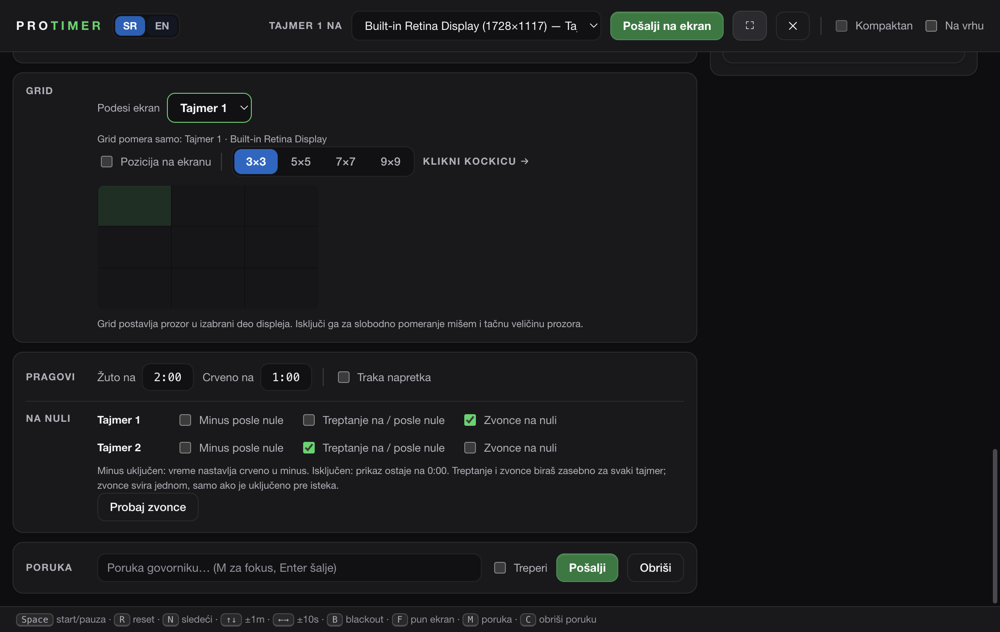

# Timer zero alerts / Upozorenja na nuli

Available in the **2.5.0-streamdeck.3 prerelease**. Stable 2.4.1 remains unchanged. [Release notes](RELEASE-NOTES-2.5.0-streamdeck.3.md).

## Srpski

U **Kontroli → Pragovi → Na nuli** svaki tajmer ima svoj red:

- **Minus posle nule**: uključeno — taj tajmer nastavlja da prikazuje prekoračenje crvenim minus vremenom; isključeno — prikaz ostaje crven na **0:00**. Tajmer 1 i Tajmer 2 mogu imati različit izbor, na zajedničkom ili odvojenim ekranima i telefonu. Promena izbora ne resetuje niti menja rok aktivnog tajmera. Interno merenje prekoračenja i rundown ostaju očuvani; ponovno uključivanje minusa tokom istog odbrojavanja pokazuje stvarno prekoračenje.
- **Treptanje na / posle nule**: uključuje ili isključuje treptanje cifara. Kada je isključeno, vreme na nuli i u minusu ostaje crveno i mirno. Važi za kontrolu, zajednički prikaz, zaseban izlaz i telefon. Ne treperi ceo ekran.
- **Zvonce na nuli**: jedan zvuk kada taj tajmer stigne do nule. Isključivanje ne utiče na drugi tajmer. Uključivanje nakon isteka ne pušta zakasnelo zvonce; reset ili novo pozitivno vreme priprema sledeće upozorenje.

Red za Tajmer 2 vidi se samo dok je drugi tajmer uključen. Izbori se pamte pri ponovnom otvaranju aplikacije. Raniji izbori za Tajmer 1 ostaju; pri nadogradnji Tajmer 2 preuzima raniji zajednički izbor minusa, a zatim se podešava nezavisno. Zvonce za Tajmer 2 je podrazumevano isključeno.

Ugrađeno zvonce sada ima metalni udar i prirodniji odjek od oko **2,2 sekunde**, umesto kratkog elektronskog tona. Zvuk je originalno sintetizovan, bez tuđeg snimka ili dodatnog preuzimanja. Promena ne zamenjuje ručno izabran audio fajl.

**Probaj zvonce** ručno proverava zvuk bez pokretanja vremena ili uključivanja automatskog zvona. Zvuk se generiše samo na računaru koji pokreće ProTimer, ne dodatno na svakom telefonu ili OBS prikazu. Koristi isto zvonce, jačinu i audio izlaz kao ručno BELL dugme; podešavanje je dostupno u **Stream Deck → Zvuk i prečice**, i ne zahteva Stream Deck uređaj niti uključenu integraciju. Nestanak izabranog audio izlaza prikazuje upozorenje, bez tihog prelaska na drugi izlaz.

Ako oba tajmera isteknu istovremeno, čuje se jedno zajedničko zvonce; zvukovi se ne preklapaju i ne čekaju u redu za kasnije. Pauza/nastavak u minusu i ponovno povezivanje ne ponavljaju upozorenje. Štoperica i prikaz sata nemaju automatsko zvonce na nuli.

## English

In **Control → Warnings → At zero**, each timer has independent **Count past zero**, **Blink at / after zero** and **Bell at zero** switches. Count past zero on shows red negative time; off holds the display at **0:00**. Turning blink off retains steady red digits. These choices apply to Control, combined and separate output windows, phone views and native Deck state. Timer 2's row appears only when enabled; settings persist independently. Existing Timer 1 sound preferences are preserved and Timer 2 sound is opt-in. Older shared overtime preferences migrate to Timer 2 once; later edits are independent.

Holding the display at zero does not rewrite an active deadline or disrupt rundown tracking. Re-enabling overtime during the same countdown reveals the actual overrun. The built-in bell now has an original synthesized metal strike and natural **2.2-second** decay, with no third-party recording, download or clipping. A custom selected audio file remains unchanged.

The bell fires once per positive countdown crossing. Enabling sound after expiry, reconnecting or resuming negative time never replays it. A reset or positive time adjustment re-arms the next crossing. Simultaneous expiries share a single non-overlapping bell. Sound plays on the host computer only, using the configured manual bell audio route. **Test bell** does not enable automatic alerts or change timer state. Stream Deck hardware is not required.

## Local verification — 2026-09-26

These results describe the local preview tested before publication. They do not establish the outcome of a GitHub CI or release build. Installers are published only after automated packaged smoke checks pass on macOS and Windows; see the [public workflow runs](https://github.com/srdjankotarlic/protimer/actions) for those results. Physical Stream Deck and audio-hardware acceptance remain separate checks.

- `npm test`: 149 passing tests. Coverage includes 12 audio tests (waveform at 44.1/48 kHz, metal resonances, decay, caching, no overlap, routing and custom-file preservation), 9 overtime projection/view tests, 5 actual-controller overtime tests, 17 zero-crossing tests and the existing regression suite.
- `npm run smoke:alerts`: 32 checks passed in real Electron: independent minus/zero choices in both directions, both output arrangements, checkbox persistence, live deadline preservation, bell at zero with minus disabled, independent sound flags, one-shot behavior, no late replay, independent blinking/steady red, hidden unused T2 controls, manual test without opt-in, SR/EN reflow at 820/1120 widths, and a real muted Web Audio start without a keyboard gesture.
- `npm run deck:test`: TypeScript check and 11 existing plugin tests passed.
- `npm run smoke`: the first run found a timing-sensitive compact-window smoke check. It now explicitly paints the real received state before waiting for fit-window IPC, avoiding a false failure from macOS throttling occluded windows. A second development run hit OS fullscreen/Viz timeouts. The final packaged full run below passed all of these same checks; no fullscreen production behavior was changed.
- `npm run check:packaging`, `npm run check:public-docs` and `git diff --check`: passed.
- macOS ARM64 build command: `npx electron-builder --mac --arm64 --dir --publish never -c.extraMetadata.version=2.5.0-streamdeck.3`; bundled plugin/tunnel resources verified by afterPack.
- `dist-installers/mac-arm64/ProTimer.app/Contents/MacOS/ProTimer --smoke`: **passed, exit 0, SMOKE_OK**, including compact size, fullscreen, both outputs, rundown, phone remote, network, native integration and all **32 alert/overtime checks**.
- Built `app.asar` SHA-256: `8ab40fd014b30d29ff1f377a7bf3efc7f78ba9fcffccf071be7bf46f5d9b09e7`.
- The verified local Mac preview was installed after the previous app and user data were backed up. Its version and app.asar hash matched the tested package. Normal launch showed Control, stopped timers, closed audience output, both independent overtime controls and the existing rundown. This installation check does not verify a public installer or physical Stream Deck hardware.

Automated playback interception checks when sound is requested. The additional muted Web Audio check verifies real synthesis/start, **not audible physical speakers**. Use Test bell before a show to verify the selected device and volume. These local results do not include Windows runtime or physical Stream Deck testing.

Implementation: `timer-alerts.js`, `controller.html`, `timer-tools.js`, `output.html`, `remote.html`, shared `deck-audio.js`/`deck-controller.js`; tests in `test/deck-audio.test.js`, `test/timer-alerts.test.js`, `test/controller-zero-alerts.test.js`, `test/zero-alert-views.test.js`, `test/overtime-views.test.js`, `test/controller-overtime.test.js` and `scripts/smoke-alerts.js`. `main.js` and `package.json` include the smoke/package resources. The separate-output smoke explicitly paints a fully occluded window before asserting its layout.

